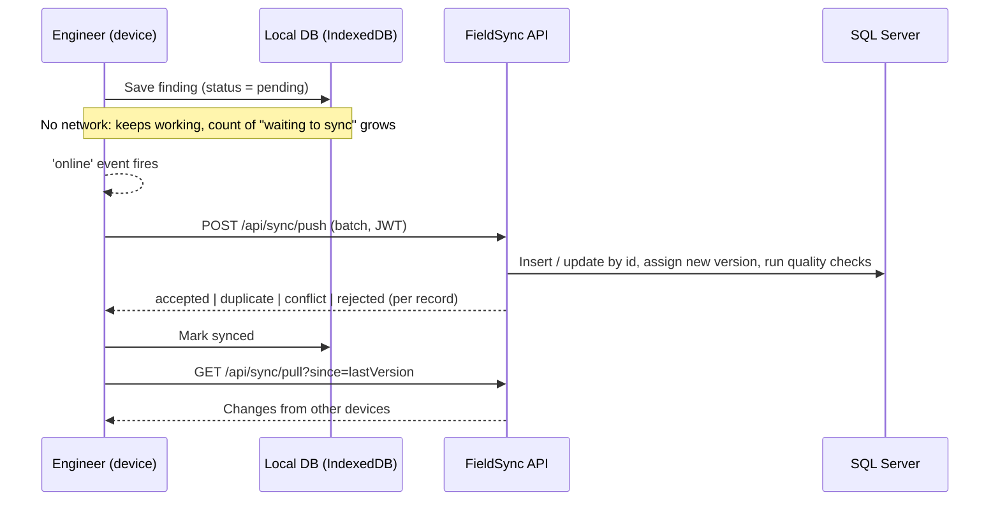

# FieldSync: offline-first field survey app


Exploration engineers record **where** they took a sample (GPS coordinates) and **what** they found (rock type, depth, oil or gas shows), often in places with **no mobile signal**. FieldSync saves every finding on the device first and **syncs automatically when the network comes back**, with no duplicates and no lost edits.

> Portfolio project inspired by field-data work during my internship at ONGC. It is not affiliated with ONGC and uses **synthetic data only**.
> The same pattern applies to any field crew that works in poor coverage: utilities, road inspection, forestry, environmental sampling.

<!-- Add a screenshot or GIF here: docs/demo.gif -->

## Features
- **Offline capture**: form plus device GPS (GPS works without network). Data lands in IndexedDB instantly.
- **Automatic sync**: detects when the network returns and pushes pending records in batches, then pulls changes from other devices.
- **Safe retries**: the device generates the record id, so re-sending the same batch after a dropped connection never creates duplicates.
- **Conflict handling**: if two devices edit the same finding, the server keeps its copy and stores the other edit for an analyst to review. Nothing is silently overwritten.
- **Data-quality checks**: flags locations outside the survey block, weak GPS fixes, unusual rock and hydrocarbon combinations, and possible duplicates within 5 m.
- **Security**: JWT login with Engineer, Analyst and Admin roles, the engineer's name taken from the token rather than the device, server-side validation, a rate-limited login, and CORS allow-list.
- **Office dashboard**: totals and per-expedition breakdown, side-by-side conflict review with Keep server / Keep device, and a list of quality-flagged findings. Admins can also **add / edit / delete findings**, synced to every device like a field capture (the original engineer is kept). Sign-in routes each role to its own home page.

  | Role | Capture | Dashboard + conflict review | Add / edit / delete |
  |---|---|---|---|
  | Engineer | ✓ | | |
  | Analyst | | ✓ | |
  | Admin | | ✓ | ✓ |
- **Map view** of findings coloured by hydrocarbon indicator. Installable **PWA** that loads with no network.

## Tech stack
| Layer | Technology |
|---|---|
| API | ASP.NET Core 8 Web API (C#), Entity Framework Core 8, REST, Swagger |
| Database | SQL Server (LocalDB by default, or Docker); optional Oracle PL/SQL reporting (`oracle/reporting.sql`) |
| Web / mobile | Angular 19, TypeScript, Dexie.js (IndexedDB), Leaflet, Angular service worker (PWA) |
| Testing | xUnit integration tests (in-memory SQLite), Playwright end-to-end test for offline to online sync |
| CI | GitHub Actions |

## Architecture


## Sync rules (server)
| Situation | Result |
|---|---|
| Id not seen before | **accepted**: inserted, new version assigned |
| Same device and same edit timestamp already stored (a retry) | **duplicate**: nothing changes, same version returned |
| Edit based on the current server version | **accepted**: updated, new version |
| Edit based on an older version (someone else changed it first) | **conflict**: server copy kept, edit stored for analyst review |
| Fails validation | **rejected** with reasons |

## Run it locally
Needs the .NET 8 SDK, Node 20/22 LTS and SQL Server LocalDB (installed with SQL Server Express).
```bash
cd backend/FieldSync.Api && dotnet run                 # creates the DB on first run; API on http://localhost:5080/swagger
cd fieldsync-web && npm install && npx ng serve        # (second terminal) app on http://localhost:4200
```
Prefer Docker? `docker compose up -d`, then run the API with
`ConnectionStrings__Default="Server=localhost,1433;Database=FieldSync;User Id=sa;Password=FieldSync_Dev_2026!;TrustServerCertificate=True"`.

> The JWT key and demo passwords in `appsettings.json` are for **local development only**. Production would keep secrets in a secret store (Azure Key Vault / user-secrets) and use hashed passwords or Microsoft Entra ID.

Demo users: `engineer1 / Field@123`, `engineer2 / Field@123`, `analyst1 / Office@123`, `admin1 / Admin@123`.

**Try the offline demo:** sign in, open DevTools, go to Network, set it to **Offline**, save 3 findings, then switch back to **No throttling** and watch them sync.

## Tests
Manual QA checklist: [docs/test-plan.md](docs/test-plan.md).
```bash
dotnet test backend/FieldSync.sln          # 14 API tests: idempotency, conflicts, admin edits and deletes, validation, malformed batches, auth and role rules, quality checks
cd e2e && npm install && npx playwright test   # offline capture -> auto sync; analyst resolves a conflict; admin adds/edits/deletes on the dashboard
```

## What I would add next
Capacitor Android build · photo upload after text sync · SQL Server `rowversion` for multi-server scaling · refresh tokens · AI suggestion of material type from field notes.
