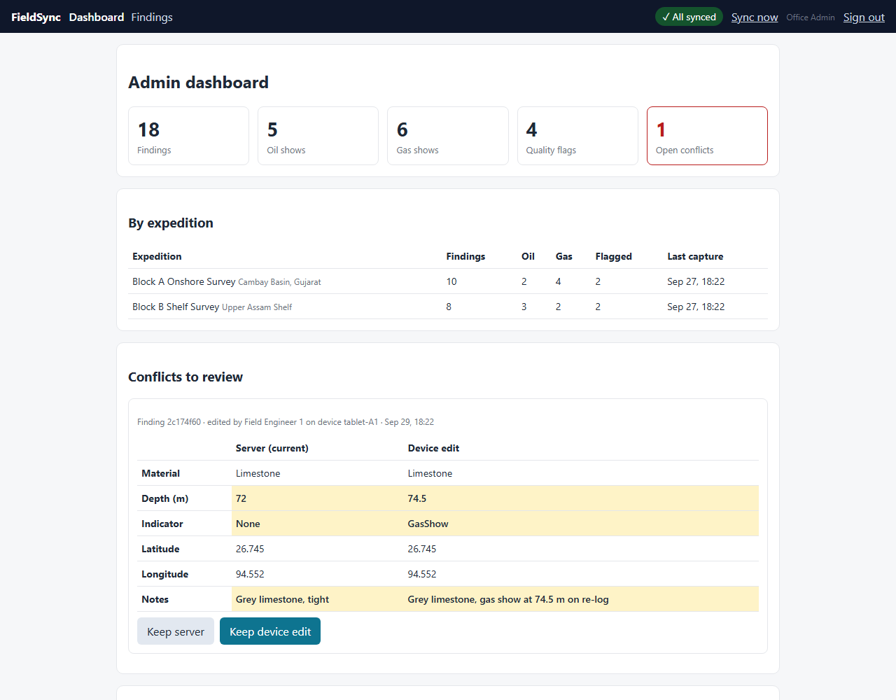
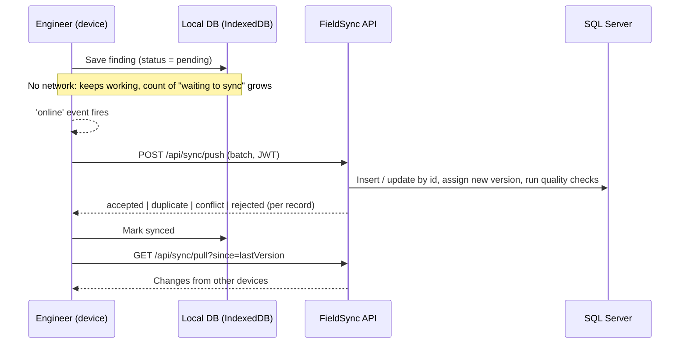

# FieldSync: offline-first field survey app


**Live demo:** https://dhruvpatel1512.github.io/FieldSync/ · sign in as `engineer1 / Field@123`, `analyst1 / Office@123` or `admin1 / Admin@123`.
The API runs on Azure free tiers (App Service F1 + Azure SQL serverless), so the first request after a quiet spell can take ~30 s while it wakes up.

Exploration engineers record **where** they took a sample (GPS coordinates) and **what** they found (rock type, depth, oil or gas shows), often in places with **no mobile signal**. FieldSync saves every finding on the device first and **syncs automatically when the network comes back**, with no duplicates and no lost edits.

> Portfolio project inspired by field-data work during my internship at ONGC. It is not affiliated with ONGC and uses **synthetic data only**.
> The same pattern applies to any field crew that works in poor coverage: utilities, road inspection, forestry, environmental sampling.

[](https://dhruvpatel1512.github.io/FieldSync/)
*Live admin dashboard: seeded demo data, quality flags and a two-device conflict waiting for review.*

## Features
- **Offline capture**: form plus device GPS (GPS works without network). Data lands in IndexedDB instantly.
- **Automatic sync**: detects when the network returns and pushes pending records in batches, then pulls changes from other devices.
- **Safe retries**: the device generates the record id, so re-sending the same batch after a dropped connection never creates duplicates.
- **Conflict handling**: if two devices edit the same finding, the server keeps its copy and stores the other edit for an analyst to review. Nothing is silently overwritten.
- **Data-quality checks**: flags locations outside the survey block, weak GPS fixes, unusual rock and hydrocarbon combinations, and possible duplicates within 5 m.
- **Security**: JWT login with Engineer, Analyst and Admin roles, the engineer's name taken from the token rather than the device, server-side validation, a rate-limited login, and CORS allow-list.
- **Office dashboard**: totals and per-expedition breakdown, side-by-side conflict review with Keep server / Keep device, and a list of quality-flagged findings. Admins can also **add / edit / delete findings**, synced to every device like a field capture (the original engineer is kept). Sign-in routes each role to its own home page.

  | Role | Capture | Dashboard + conflict review | Add / edit / delete |
  |---|---|---|---|
  | Engineer | ✓ | | |
  | Analyst | | ✓ | |
  | Admin | | ✓ | ✓ |
- **Map view** of findings coloured by hydrocarbon indicator. Installable **PWA** that loads with no network.

## Tech stack
| Layer | Technology |
|---|---|
| API | ASP.NET Core 8 Web API (C#), Entity Framework Core 8, REST, Swagger |
| Database | SQL Server (LocalDB by default, or Docker); optional Oracle PL/SQL reporting (`oracle/reporting.sql`) |
| Web / mobile | Angular 19, TypeScript, Dexie.js (IndexedDB), Leaflet, Angular service worker (PWA) |
| Testing | xUnit integration tests (in-memory SQLite), Playwright end-to-end test for offline to online sync |
| CI | GitHub Actions |

## Architecture


## Sync rules (server)
| Situation | Result |
|---|---|
| Id not seen before | **accepted**: inserted, new version assigned |
| Same device and same edit timestamp already stored (a retry) | **duplicate**: nothing changes, same version returned |
| Edit based on the current server version | **accepted**: updated, new version |
| Edit based on an older version (someone else changed it first) | **conflict**: server copy kept, edit stored for analyst review |
| Fails validation | **rejected** with reasons |

## Run it locally
Needs the .NET 8 SDK, Node 20/22 LTS and SQL Server LocalDB (installed with SQL Server Express).
```bash
cd backend/FieldSync.Api && dotnet run                 # creates the DB on first run; API on http://localhost:5080/swagger
cd fieldsync-web && npm install && npx ng serve        # (second terminal) app on http://localhost:4200
```
Prefer Docker? `docker compose up -d`, then run the API with
`ConnectionStrings__Default="Server=localhost,1433;Database=FieldSync;User Id=sa;Password=FieldSync_Dev_2026!;TrustServerCertificate=True"`.

> The JWT key and demo passwords in `appsettings.json` are for **local development only**. Production would keep secrets in a secret store (Azure Key Vault / user-secrets) and use hashed passwords or Microsoft Entra ID.

Demo users: `engineer1 / Field@123`, `engineer2 / Field@123`, `analyst1 / Office@123`, `admin1 / Admin@123`.

**Try the offline demo:** sign in, open DevTools, go to Network, set it to **Offline**, save 3 findings, then switch back to **No throttling** and watch them sync.

## Deployment
- **Web app:** GitHub Pages, published by the `pages` job in `.github/workflows/ci.yml` on every push to `main` once tests pass.
- **API + database:** deployed by the `api` job in the same workflow (GitHub OIDC login as a managed identity allowed to deploy only this web app, so no Azure secret lives in GitHub). Azure App Service (F1, Linux) and Azure SQL (free serverless offer, auto-pauses instead of billing). Production secrets (connection string, JWT key) and the CORS origin are App Service settings, not in the repo. The API applies EF migrations on startup.

- **Demo data:** `./scripts/seed-demo.ps1` pushes 18 synthetic findings (4 quality-flagged) and one open conflict through the live API; add `-Api http://localhost:5080/api` to seed a local copy. Handy after someone clears the public demo.

### Set up your own Azure deployment
Needs an Azure subscription and the [Azure CLI](https://learn.microsoft.com/cli/azure/install-azure-cli); everything below stays on free tiers. Run in bash (Git Bash on Windows) after `az login`.

```bash
RG=fieldsync-rg; LOC=canadacentral; SQL=fieldsync-sql-yourname; APP=fieldsync-api-yourname   # SQL and APP names must be globally unique
REPO=your-github-user/FieldSync; ORIGIN=https://your-github-user.github.io
SQL_USER=fieldsyncadmin; SQL_PASS="$(openssl rand -base64 24)Az9-"; JWT_KEY=$(openssl rand -base64 48)

# 1. New subscriptions must register these providers once
az provider register -n Microsoft.Sql --wait
az provider register -n Microsoft.Web --wait

# 2. Database: Azure SQL free serverless offer (pauses at the monthly free limit instead of billing)
az group create -n $RG -l $LOC
az sql server create -g $RG -n $SQL -l $LOC -u $SQL_USER -p "$SQL_PASS"
az sql server firewall-rule create -g $RG -s $SQL -n AllowAzureServices --start-ip-address 0.0.0.0 --end-ip-address 0.0.0.0
az sql db create -g $RG -s $SQL -n FieldSync -e GeneralPurpose -f Gen5 -c 2 --compute-model Serverless \
  --use-free-limit --free-limit-exhaustion-behavior AutoPause --backup-storage-redundancy Local

# 3. API host: App Service F1 (free). New subscriptions often have no F1 quota in some regions;
#    if this fails with "Current Limit (F1 VMs): 0", try another -l (centralus worked here). The API may live in a different region than the DB.
az appservice plan create -g $RG -n fieldsync-plan -l centralus --sku F1 --is-linux
az webapp create -g $RG -p fieldsync-plan -n $APP --runtime 'DOTNETCORE:8.0'
az webapp update -g $RG -n $APP --https-only true

# 4. Production settings: secrets live here, never in the repo
az webapp config appsettings set -g $RG -n $APP --settings \
  "ConnectionStrings__Default=Server=tcp:$SQL.database.windows.net,1433;Database=FieldSync;User ID=$SQL_USER;Password=$SQL_PASS;Encrypt=True;Connection Timeout=60" \
  "Jwt__Key=$JWT_KEY" "Cors__Origins__0=$ORIGIN" "Cors__Origins__1=$ORIGIN"

# 5. CI deploy identity: a managed identity trusted only for this repo's main branch (works even where you can't register apps)
az identity create -g $RG -n fieldsync-github-deploy
IDS=$(gh api repos/$REPO --jq '"\(.owner.login)@\(.owner.id)/\(.name)@\(.id)"')   # GitHub's OIDC subject uses immutable IDs
az identity federated-credential create -g $RG --identity-name fieldsync-github-deploy -n github-main \
  --issuer https://token.actions.githubusercontent.com --subject "repo:$IDS:ref:refs/heads/main" --audiences api://AzureADTokenExchange
az role assignment create --assignee-object-id $(az identity show -g $RG -n fieldsync-github-deploy --query principalId -o tsv) \
  --assignee-principal-type ServicePrincipal --role 'Website Contributor' --scope $(az webapp show -g $RG -n $APP --query id -o tsv)

# 6. GitHub: variables for the api job (IDs, not secrets) and Pages deployed from Actions
gh variable set AZURE_CLIENT_ID --body $(az identity show -g $RG -n fieldsync-github-deploy --query clientId -o tsv) -R $REPO
gh variable set AZURE_TENANT_ID --body $(az account show --query tenantId -o tsv) -R $REPO
gh variable set AZURE_SUBSCRIPTION_ID --body $(az account show --query id -o tsv) -R $REPO
gh api -X POST repos/$REPO/pages -f build_type=workflow
```

For a fork, also change the API URL in `fieldsync-web/src/app/core/config.ts` and `app-name` in the `api` job of `ci.yml`, then push to `main`: CI runs the tests, deploys the API (which creates the tables on first start) and publishes the site. If you ever recreate the GitHub repo, its ID changes, so update the step 5 federated credential with `az identity federated-credential update` and the new subject.

## Tests
Manual QA checklist: [docs/test-plan.md](docs/test-plan.md).
```bash
dotnet test backend/FieldSync.sln          # 16 API tests: idempotency, conflicts, admin edits and deletes, validation, malformed batches, auth and role rules, quality checks
cd e2e && npm install && npx playwright test   # offline capture -> auto sync; analyst resolves a conflict; admin adds/edits/deletes on the dashboard
```
